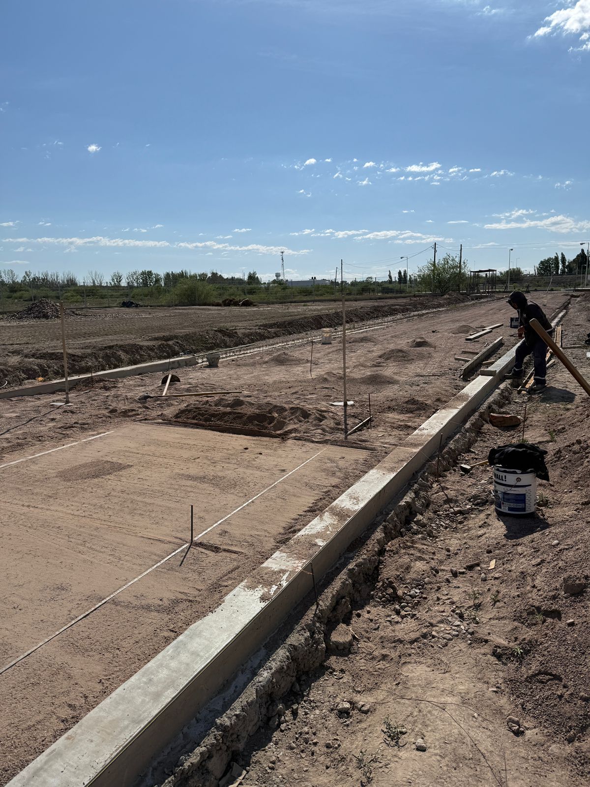

```{r setup, include=FALSE}
library(flexdashboard)
```

# Estado General del Proyecto

## Column {data-width="350"}

### Imagenes de proyecto

```{r}


```

{width="60%"}

Foto del estado de calle de entrada

## Column {data-width="850"}

### Chart B

```{r}

```

### Chart C

```{r}

```

# Cronograma de desembolsos

### ENERO 2025

-   Subcontratos
-   Mano de obra
-   Materiales Aridos
-   Materiales Cementos
-   Materiales Hierros
-   Materiales Encofrados

| Nombre del Contratista | Tarea | Fecha de inicio | Fecha de fin | Valor final |
|---------------|---------------|---------------|---------------|---------------|
| Ortubia | Movimientos de suelos | 08/01/2025 | 13/01/2025 |  |
| Gonzalez | Hormigones en plateas | 24/01/2025 |  |  |
| Gonzalez | Armado de estructuras de hierro | 12/01/2025 |  |  |

# Grado de avance

```{r}
library(ggplot2)
library(dplyr)
library(tidyr)

# 1. Preparar los datos
meses <- factor(
  c("Enero", "Febrero", "Marzo", "Abril", "Mayo", "Junio",
    "Julio", "Agosto", "Septiembre", "Octubre", "Noviembre", "Diciembre"),
  levels = c("Enero", "Febrero", "Marzo", "Abril", "Mayo", "Junio",
             "Julio", "Agosto", "Septiembre", "Octubre", "Noviembre", "Diciembre")
)

# Avance Teórico (100 / 12 para cada mes)
avance_teorico <- rep(100/12, 12)

# Avance Real (los valores que proporcionaste)
avance_real <- c(5, 8, 12, 10.5, 11.5, 9, 4, 12, 7, 0, 0, 0)

# Crear un dataframe inicial
datos_avance <- data.frame(
  Mes = meses,
  Teorico = avance_teorico,
  Real = avance_real
)

# Transformar los datos a formato largo (tidy data) para ggplot
# Esto es esencial para graficar dos grupos de barras
datos_long <- datos_avance %>%
  pivot_longer(
    cols = c(Teorico, Real),
    names_to = "Tipo_Avance",
    values_to = "Porcentaje"
  )

# 2. Generar el Gráfico con ggplot2
ggplot(datos_long, aes(x = Mes, y = Porcentaje, fill = Tipo_Avance)) +
  # Crear las barras
  geom_bar(stat = "identity", position = position_dodge(width = 0.8), width = 0.7) +
  # Añadir etiquetas de texto sobre las barras
  geom_text(
    aes(label = paste0(round(Porcentaje, 1), "%")),
    # Colocar el texto un poco más arriba de la barra
    vjust = -0.5,
    # Asegurar que el texto se esquive con las barras
    position = position_dodge(width = 0.8),
    size = 3
  ) +
  # Etiquetas y títulos
  labs(
    title = "Avance de Obra: Teórico vs. Real (Porcentaje Mensual)",
    x = "Mes",
    y = "Porcentaje de Avance (%)",
    fill = "Tipo de Avance"
  ) +
  # Ajustar el eje Y para que vaya de 0 a un poco más del máximo
  scale_y_continuous(limits = c(0, max(datos_long$Porcentaje) * 1.1),
                     labels = function(x) paste0(x, "%")) +
  # Personalización del tema (opcional)
  theme_minimal() +
  # Cambiar los colores (opcional)
  scale_fill_manual(values = c("Teorico" = "skyblue", "Real" = "darkgreen")) +
  # Rotar texto del eje X si es necesario, pero aquí no lo es
  theme(axis.text.x = element_text(angle = 45, hjust = 1))
```

### PAGINA 1

-   Subcontratos
-   Mano de obra

| Nombre del Contratista   | Avance Proyectado               |
|--------------------------|---------------------------------|
| Carpinterias de aluminio | Mediciones                      |
| Metalurgicos             | Hormigones en plateas           |
| Gonzalez                 | Armado de estructuras de hierro |

\`\`\`{r}
