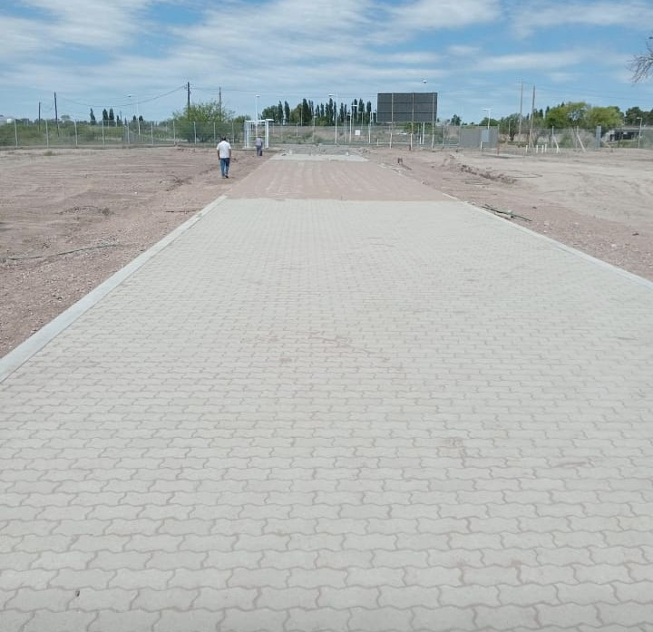
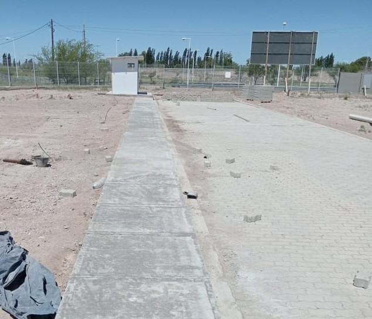

```{r setup, include=FALSE}
library(flexdashboard)
```

# Estado General del Proyecto

## Column {data-width="350"}

### Imagenes de proyecto

```{r}


```

{width="85%"}

## Column {data-width="850"}

### Imagenes de ultimos avances

```{r}

```

{width="45%"} {width="48%"}

### Graficos de cotos de obra

```{r}

# Instala la librería plotly si no la tienes
# install.packages("plotly")

library(plotly)
library(dplyr) # Útil para manejar data frames

# 1. Crear el data frame con los costos
datos_costos <- data.frame(
  Variable = c("Materiales", "Mano de Obra", "Combustibles", "Maquinarias", "Mantenimiento"),
  Costo = c(580, 380, 30, 50, 150)
)

#datos_costos = data.frame(Prueba)


# 2. Calcular el porcentaje para las etiquetas (opcional, pero útil)
datos_costos <- datos_costos %>%
  mutate(Porcentaje = round(Costo / sum(Costo) * 100, 1))

# 3. Crear el gráfico de pastel interactivo con plotly
plot_ly(datos_costos,
        labels = ~Variable,
        values = ~Costo,
        type = 'pie',
        # Configurar el texto que aparece sobre la sección
        textinfo = 'label+percent',
        # Configurar el texto que aparece al pasar el ratón (tooltip)
        hovertemplate = "Variable: %{label}<br>Costo: $%{value}<br>Porcentaje: %{percent}<extra></extra>"
        ) %>%
  layout(title = 'Distribución de Costos Semanales de Obra')


```

# Cronograma de desembolsos

### ENERO 2025

-   Subcontratos
-   Mano de obra Albañileria - Gonzalez
-   Mano de obra Metalurgica - Ortubia
-   Mano de obra Sanitaria - Moreno
-   Mano de obra Electrica - Rodriguez

| Nombre del Contratista | Tarea | Fecha de inicio | Fecha de fin | Valor final |
|---------------|---------------|---------------|---------------|---------------|
| Ortubia | Movimientos de suelos | 08/01/2025 | 13/01/2025 |$450 |
| Gonzalez | Hormigones en plateas | 24/01/2025 | 31/01/2025 |$600 |
| Sanitaria | Armado base de cloaca | 12/01/2025 | 17/01/2025 |$250 |

```{r}

# Instala la librería plotly si no la tienes
# install.packages("plotly")

library(plotly)
library(dplyr) # Útil para manejar data frames

# 1. Crear el data frame con los costos de manos de obra
datos_costos <- data.frame(
  Variable = c("Gonzalez", "Ortubia", "Subcontrato", "Sanitarista", "Electricista"),
  Costo = c(600, 450, 300, 250, 350)
)

#datos_costos = data.frame(Prueba)


# 2. Calcular el porcentaje para las etiquetas (opcional, pero útil)
datos_costos <- datos_costos %>%
  mutate(Porcentaje = round(Costo / sum(Costo) * 100, 1))

# 3. Crear el gráfico de pastel interactivo con plotly
plot_ly(datos_costos,
        labels = ~Variable,
        values = ~Costo,
        type = 'pie',
        # Configurar el texto que aparece sobre la sección
        textinfo = 'label+percent',
        # Configurar el texto que aparece al pasar el ratón (tooltip)
        hovertemplate = "Variable: %{label}<br>Costo: $%{value}<br>Porcentaje: %{percent}<extra></extra>"
        ) %>%
  layout(title = 'Distribución de Costos Semanales de Obra')


```

# Grado de avance

```{r, fig.width=5, fig.height=4}
library(ggplot2)
library(dplyr)
library(tidyr)

# 1. Preparar los datos
meses <- factor(
  c("Enero", "Febrero", "Marzo", "Abril", "Mayo", "Junio",
    "Julio", "Agosto", "Septiembre", "Octubre", "Noviembre", "Diciembre"),
  levels = c("Enero", "Febrero", "Marzo", "Abril", "Mayo", "Junio",
             "Julio", "Agosto", "Septiembre", "Octubre", "Noviembre", "Diciembre")
)

# Avance Teórico (100 / 12 para cada mes)
avance_teorico <- rep(100/12, 12)

# Avance Real (los valores que proporcionaste)
avance_real <- c(5, 8, 12, 10.5, 11.5, 9, 4, 12, 7, 0, 0, 0)

# Crear un dataframe inicial
datos_avance <- data.frame(
  Mes = meses,
  Teorico = avance_teorico,
  Real = avance_real
)

# Transformar los datos a formato largo (tidy data) para ggplot
# Esto es esencial para graficar dos grupos de barras
datos_long <- datos_avance %>%
  pivot_longer(
    cols = c(Teorico, Real),
    names_to = "Tipo_Avance",
    values_to = "Porcentaje"
  )

# 2. Generar el Gráfico con ggplot2
ggplot(datos_long, aes(x = Mes, y = Porcentaje, fill = Tipo_Avance)) +
  # Crear las barras
  geom_bar(stat = "identity", position = position_dodge(width = 0.6), width = 0.5) +
  # Añadir etiquetas de texto sobre las barras
  geom_text(
    aes(label = paste0(round(Porcentaje, 1), "%")),
    # Colocar el texto un poco más arriba de la barra
    vjust = -0.5,
    # Asegurar que el texto se esquive con las barras
    position = position_dodge(width = 0.8),
    size = 3
  ) +
  # Etiquetas y títulos
  labs(
    title = "Avance de Obra: Teórico vs. Real (Porcentaje Mensual)",
    x = "Mes",
    y = "Porcentaje de Avance (%)",
    fill = "Tipo de Avance"
  ) +
  # Ajustar el eje Y para que vaya de 0 a un poco más del máximo
  scale_y_continuous(limits = c(0, max(datos_long$Porcentaje) * 1.1),
                     labels = function(x) paste0(x, "%")) +
  # Personalización del tema (opcional)
  theme_minimal() +
  # Cambiar los colores (opcional)
  scale_fill_manual(values = c("Teorico" = "skyblue", "Real" = "darkgreen")) +
  # Rotar texto del eje X si es necesario, pero aquí no lo es
  theme(axis.text.x = element_text(angle = 25, hjust = 1))
```

### CONTROL DE MANOS DE OBRA

-   Subcontratos
-   Mano de obra

| Nombre del Contratista   | Avance Proyectado               |
|--------------------------|---------------------------------|
| Carpinterias de aluminio | Mediciones                      |
| Metalurgicos             | Hormigones en plateas           |
| Gonzalez                 | Armado de estructuras de hierro |

\`\`\`{r}
